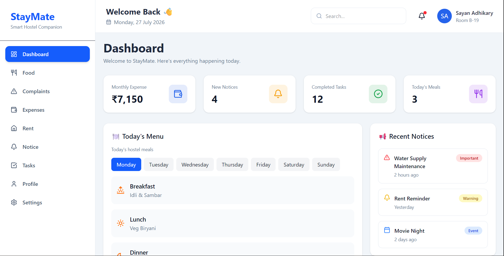
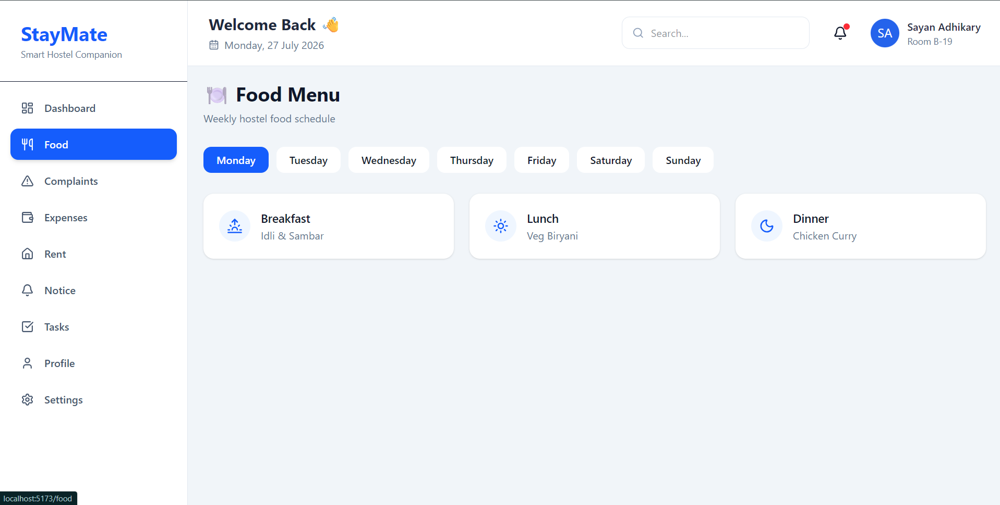
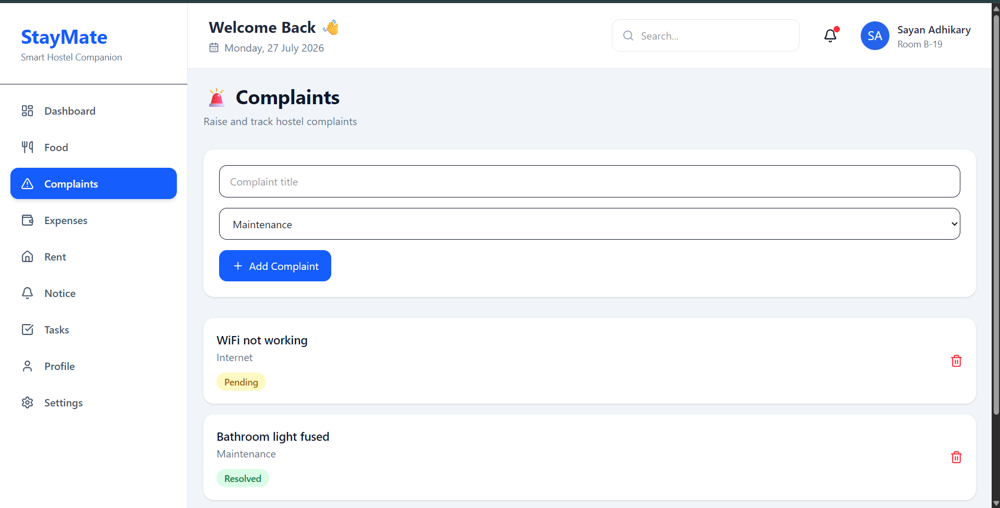
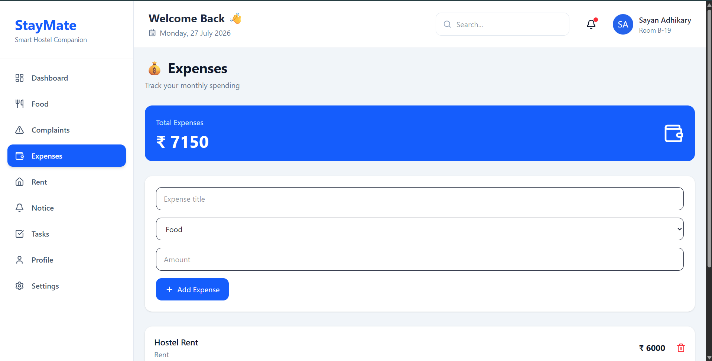
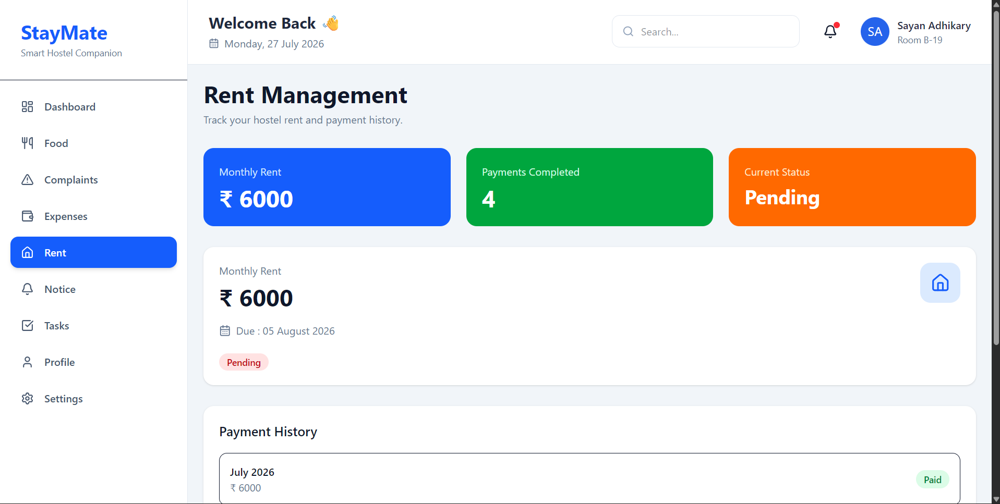
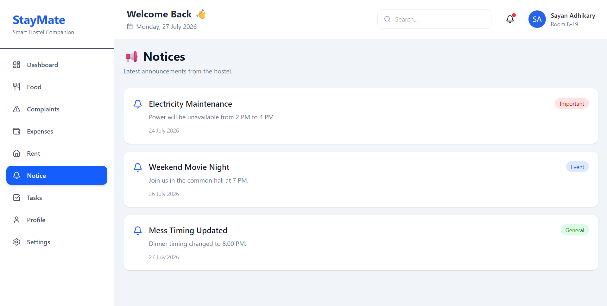
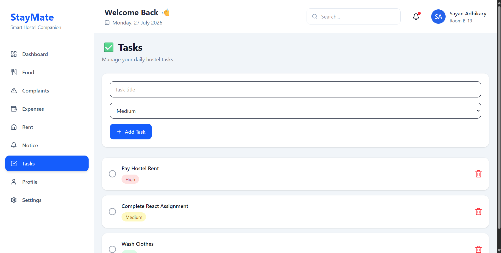
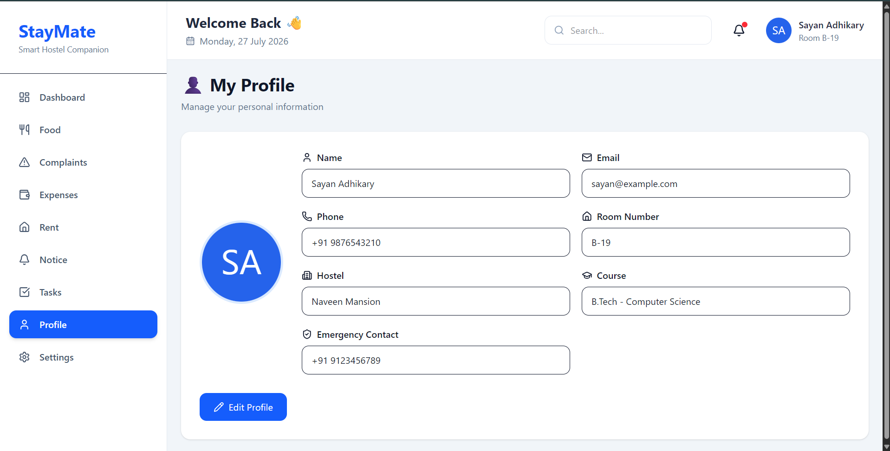
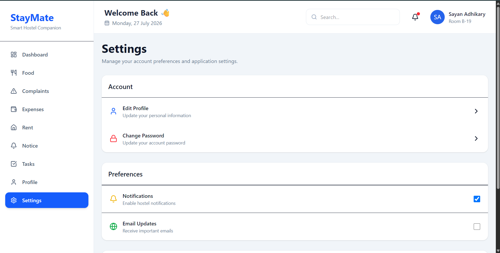

# 🏠 StayMate – Smart Hostel & PG Companion

StayMate is a modern React-based web application designed to simplify hostel and PG management for students and working professionals. It provides a centralized dashboard to manage daily hostel activities such as food menus, rent tracking, expenses, complaints, notices, and personal tasks.

> A clean, responsive, and component-based React application built with modern frontend technologies.

---

## 📸 Project Preview

## [](https://drive.google.com/file/d/19LOys-pVPuzccDGi63wEchVkOGs8867y/view?usp=sharing)

## 🚀 Features

### 📊 Dashboard

- Hostel overview dashboard
- Monthly rent summary
- Expense summary
- Pending complaints
- Completed tasks
- Today's menu
- Recent notices
- Quick summary section

---

### 🍽️ Food Management

- Daily hostel menu
- Breakfast, Lunch & Dinner
- Clean card-based layout

---

### 💰 Rent Management

- Monthly rent details
- Due date tracking
- Payment status
- Payment history

---

### 💸 Expense Tracker

- Track monthly expenses
- Expense summary cards
- Organized expense categories

---

### 📢 Notice Board

- Important hostel announcements
- Organized notice cards
- Easy-to-read interface

---

### 📝 Task Manager

- Daily task list
- Track pending and completed tasks
- Simple and clean UI

---

### 🚨 Complaint Management

- View hostel complaints
- Complaint status
- Organized complaint cards

---

### 👤 User Profile

- Personal details
- Hostel information
- Profile overview

---

### ⚙️ Settings

- Theme Management
- Notification Preferences
- Account Settings
- Privacy Settings

---

## 🛠️ Tech Stack

| Technology        | Purpose            |
| ----------------- | ------------------ |
| React.js          | Frontend Framework |
| React Router DOM  | Routing            |
| Tailwind CSS      | Styling            |
| Lucide React      | Icons              |
| Context API       | Theme Management   |
| JavaScript (ES6+) | Logic              |
| Vite              | Build Tool         |

---

## 📂 Project Structure

```text
src/
│
├── components/
│   ├── dashboard/
│   ├── rent/
│   ├── complaints/
│   ├── layout/
│   └── food/
│
├── context/
|
├── data/
│   ├── complaintData.js
│   ├── expenseData.js
│   ├── menuData.js
│   ├── noticeData.js
│   ├── noticePageData.js
│   ├── profileData.js
│   ├── rentData.js
│   ├── statData.js
│   ├── taskData.js
│   └── taskPageData.js
|
├──layouts/
|
├── pages/
|   ├── Complaints.jsx
│   ├── Dashboard.jsx
│   ├── Expenses.jsx
│   ├── Food.jsx
│   ├── Login.jsx
│   ├── NotFound.jsx
│   ├── Notice.jsx
│   ├── Profile.jsx
|   ├── Register.jsx
│   ├── Rent.jsx
│   ├── Settings.jsx
│   └── Tasks.jsx
|
├── routes/
├── styles/
├── App.jsx
├── main.jsx
├── index.html
├── package.json
└── README.md
```

---

## 🎯 Concepts Used

- React Functional Components
- React Hooks
- useState
- Context API
- React Router
- Component Reusability
- Props
- Conditional Rendering
- Dynamic Rendering
- Responsive Layout
- Folder Organization

---

## 🎨 UI Highlights

- Modern Dashboard Design
- Responsive Layout
- Reusable Components
- Card-Based UI
- Clean Typography
- Interactive Navigation
- Professional Sidebar
- Sticky Navbar
- Dark Mode Support

---

## 📦 Installation

Clone the repository

```bash
git clone https://github.com/sayan-adhikary/staymate.git
```

Move into the project

```bash
cd staymate
```

Install dependencies

```bash
npm install
```

Start the development server

```bash
npm run dev
```

---

## 📷 Screenshots

### Dashboard


---

### Food Page



---

### Complaint Page



---

### Expenses Page



---

### Rent Page



---

### Notice Page



---

### Tasks Page



---

### Profile Page



---

### Settings Page



---

## 🌟 Future Improvements

- Backend Integration
- Authentication
- Database Support
- Online Rent Payment
- Complaint Status Tracking
- Search Functionality
- User Roles
- Push Notifications
- Mobile Sidebar
- Charts & Analytics
- API Integration

---

## 📚 Learning Outcomes

This project helped me strengthen my understanding of:

- React Project Structure
- Component-Based Architecture
- State Management
- Routing
- Tailwind CSS
- Responsive Design
- Code Reusability
- Clean UI Development

---

## 🤖 AI Usage

AI was used as a development assistant throughout this project to improve productivity and learning. It helped with:

- Brainstorming project ideas and feature planning
- Designing the application architecture
- Generating reusable React component templates
- Reviewing and refactoring code for better readability
- Suggesting modern UI/UX improvements
- Debugging React and JavaScript issues
- Explaining React concepts and best practices
- Creating documentation and improving project structure

All implementation decisions, project organization, customization, testing, and integration were completed and verified by me.

This project reflects my understanding of React, component-based architecture, routing, state management, and modern frontend development, with AI serving as a coding assistant rather than a replacement for development.

---

## 🧰 Development Tools

- React
- Vite
- Tailwind CSS
- React Router
- Lucide React
- Git & GitHub
- ChatGPT (AI-assisted development)
- 

---

## 🤝 Contributing

Contributions are welcome.

If you have ideas for improving StayMate, feel free to fork the repository and submit a pull request.

---

## 📄 License

This project is open source and available under the MIT License.

---

## 👨‍💻 Author

**Sayan Adhikary**

- GitHub: https://github.com/sayan-adhikary
- LinkedIn: https://www.linkedin.com/in/sayan-adhikary-papu/

---

⭐ If you found this project helpful, consider giving it a star!
